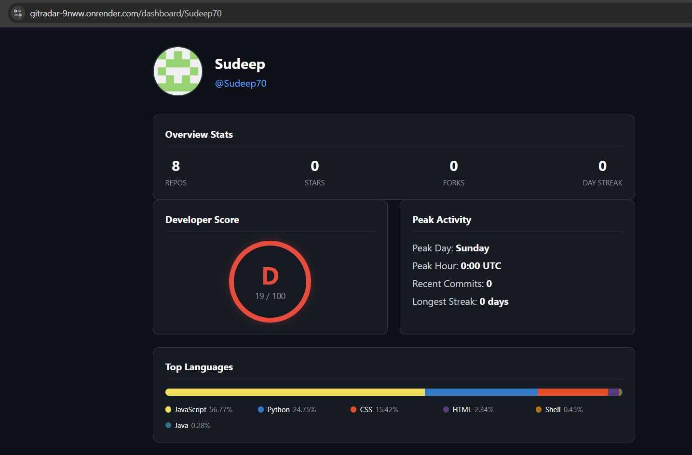

# GitRadar 🛰️

> Developer activity intelligence API — analyze any GitHub profile in seconds.

[](https://nodejs.org)
[](LICENSE)
[](https://gitradar-9nww.onrender.com/health)

**Live API → `https://gitradar-9nww.onrender.com`**

## 🖥️ Live Dashboard
**View your report visually → `https://gitradar-9nww.onrender.com/dashboard/Sudeep70`**

GitRadar is a production REST API that turns any GitHub username into a rich developer intelligence report. It also includes a visual dashboard that provides a clear, high-level breakdown of any GitHub profile's languages, activity, and score.

## Screenshots

*Live dashboard at /dashboard/:username — visualizes score, languages, and activity*

No frontend, no fluff. Pure API.

---

## Try It Right Now

No setup, no auth, just open these in your browser:

```bash
# Full developer report (JSON)
https://gitradar-9nww.onrender.com/analyze/torvalds

# Visual Dashboard (HTML)
https://gitradar-9nww.onrender.com/dashboard/Sudeep70

# Plain English Summary
https://gitradar-9nww.onrender.com/analyze/Sudeep70/summary

# Visual dashboard
https://gitradar-9nww.onrender.com/dashboard/Sudeep70

# Compare two developers
https://gitradar-9nww.onrender.com/analyze/compare/Sudeep70/torvalds

# Language breakdown only
https://gitradar-9nww.onrender.com/analyze/Sudeep70/languages

# API health + cache stats
https://gitradar-9nww.onrender.com/health
```

---

## Sample Response

```json
{
  "username": "Sudeep70",
  "name": "Sudeep",
  "score": {
    "total": 19,
    "grade": "D",
    "breakdown": {
      "consistency": 0,
      "impact": 0,
      "diversity": 19,
      "profile": 0
    },
    "max": 100
  },
  "languages": {
    "primary": "JavaScript",
    "breakdown": [
      { "language": "JavaScript", "percentage": 52.3 },
      { "language": "Python", "percentage": 27.3 },
      { "language": "HTML", "percentage": 2.6 }
    ]
  },
  "repos": {
    "total": 7,
    "total_stars": 0,
    "total_forks": 0,
    "top_repos": ["..."]
  },
  "activity": {
    "current_streak": 0,
    "peak_hour": "0:00 UTC",
    "peak_day": "Sunday",
    "heatmap": { "2026-04-21": 19, "2026-04-20": 0 },
    "event_breakdown": { "PushEvent": 12, "CreateEvent": 3 }
  }
}
```

---

## API Endpoints

| Method | Endpoint | Description |
|--------|----------|-------------|
| `GET` | `/analyze/:username` | Full developer intelligence report |
| `GET` | `/analyze/:username/score` | Developer score + grade only |
| `GET` | `/analyze/:username/languages` | Language breakdown by bytes |
| `GET` | `/analyze/:username/repos` | Repos ranked by impact score |
| `GET` | `/analyze/:username/activity` | Contribution heatmap + streaks |
| `GET` | `/analyze/compare/:user1/:user2` | Side-by-side developer comparison |
| `GET` | `/analyze/:username/summary` | Plain-English developer bio paragraph |
| `GET` | `/dashboard/:username` | Visual HTML dashboard |
| `GET` | `/health` | API health + cache stats |

---

## Developer Score Algorithm

Every profile gets a score out of 100 across four weighted categories:

| Category | Max | What it measures |
|----------|-----|-----------------|
| **Consistency** | 25 | Commit streak, recent activity volume |
| **Impact** | 25 | Total stars + forks across owned repos |
| **Diversity** | 25 | Language count, repo breadth |
| **Profile** | 25 | Bio, location, blog, followers, company |

Grades: `S` (85+) · `A` (70+) · `B` (55+) · `C` (40+) · `D` (below 40)

---

## Features

- **Real language analysis** — byte-level breakdown across top repos, not just repo labels
- **Activity heatmap** — per-day commit data, peak coding hour, busiest day of week
- **Repo intelligence** — filters forks, ranks by impact score `(stars × 2 + forks × 3)`
- **Developer comparison** — side-by-side score breakdown between any two users
- **Smart caching** — 5-minute in-memory cache, zero redundant API calls
- **Rate limiting** — 100 requests per 15 minutes per IP
- **Graceful errors** — handles private profiles, nonexistent users, GitHub rate limits

---

## Run Locally

```bash
git clone https://github.com/Sudeep70/gitradar.git
cd gitradar
npm install
cp .env.example .env
```

Add your free GitHub token to `.env`:
```
GITHUB_TOKEN=ghp_xxxxxxxxxxxxxxxxxxxx
PORT=3000
```

Get a free token at: `github.com → Settings → Developer Settings → Personal Access Tokens`
Tick only: `read:user` + `public_repo`

```bash
npm run dev
# API running at http://localhost:3000
```

---

## Run Tests

```bash
npm test
```

```
PASS tests/analyze.test.js
  ✓ GET /health returns 200
  ✓ GET /analyze/:username returns full report
  ✓ score includes grade A-S
  ✓ GET /analyze/:username/score returns score only
  ✓ GET /analyze/:username/repos filters forks
  ✓ GET /analyze/compare returns winner
```

---

## Tech Stack

| Layer | Technology |
|-------|-----------|
| Runtime | Node.js 18+ |
| Framework | Express |
| Data source | GitHub REST API v3 (free) |
| Caching | node-cache (in-memory, 5min TTL) |
| Rate limiting | express-rate-limit |
| Testing | Jest + Supertest |
| Deploy | Render |

---

## Environment Variables

| Variable | Required | Default | Description |
|----------|----------|---------|-------------|
| `GITHUB_TOKEN` | Recommended | — | Free GitHub PAT — 5,000 req/hr vs 60/hr without |
| `PORT` | No | 3000 | Server port |
| `CACHE_TTL` | No | 300 | Cache TTL in seconds |

---

## License

MIT — use it, fork it, build on it.
